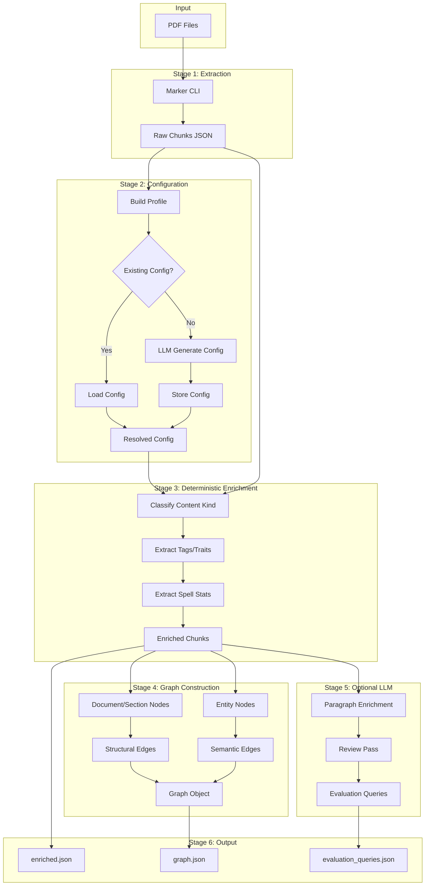

# RulesIngestion Architecture

**Last Updated:** 2026-01-27  
**Status:** Canonical Reference

---

## Overview

RulesIngestion is a document processing pipeline that transforms TTRPG rulebook PDFs into structured, graph-connected, retrieval-ready artifacts. It is the **ingestion layer** of the DungeonMind rules system; the **retrieval layer** is handled by RulesLawyer.

### Core Philosophy

**Determinism First**: All deterministic enrichment (content classification, tag extraction, graph construction) happens before any LLM calls. This ensures:
- Reproducibility (same input → same output)
- Speed (no API latency for core extraction)
- Debuggability (rule-based logic is traceable)

LLM passes are optional enhancements, not dependencies.

---

## System Boundaries

```
┌─────────────────────────────────────────────────────────────────────┐
│                         RulesIngestion                              │
│  (PDF → Enriched Chunks + Graph → Disk/MongoDB)                    │
│                                                                     │
│  OWNS:                                                              │
│  • PDF extraction (via Marker CLI)                                  │
│  • Deterministic content classification                             │
│  • Graph construction (structural + semantic edges)                 │
│  • Ruleset config generation/storage                                │
│  • Evaluation query generation                                      │
│  • Edge discovery (deterministic references)                        │
└─────────────────────────────────────────────────────────────────────┘
                              │
                              │ Output Files
                              │ (enriched.json, graph.json, etc.)
                              ▼
┌─────────────────────────────────────────────────────────────────────┐
│                          RulesLawyer                                │
│  (Query → Hybrid Retrieval → LLM Answer)                           │
│                                                                     │
│  OWNS:                                                              │
│  • Embedding generation (at load time)                              │
│  • Hybrid retrieval (BM25 + semantic + graph boost)                 │
│  • Chapter routing                                                  │
│  • LLM answer generation                                            │
│  • Runtime query processing                                         │
└─────────────────────────────────────────────────────────────────────┘
```

### What RulesIngestion Does NOT Do

- **Runtime rule evaluation** - RulesLawyer handles queries
- **Embedding generation** - Done separately or at RulesLawyer load time
- **Rule conflict resolution** - Not in scope
- **Rule interpretation/execution** - Retrieval only, not game logic

---

## Module Map

### Core Modules

| Module | Location | Responsibility |
|--------|----------|----------------|
| **ingest.py** | Root | Primary CLI entry point; batch processing orchestration |
| **rules_ingestion_pipeline.py** | Root | Core pipeline logic; PDF → enriched chunks → graph |
| **ingestion_service.py** | Root | FastAPI HTTP service for async job processing |
| **main.py** | Root | Thin wrapper (delegates to pipeline); deprecated |

### Enrichment Modules

| Module | Location | Responsibility |
|--------|----------|----------------|
| **chunks.py** | `enrichment/` | `EnrichedChunk` dataclass; `enrich_chunk()` function |
| **extractors.py** | `enrichment/` | Content classification, tag/trait extraction, spell/feat detection |
| **graph_builder.py** | `enrichment/` | `build_chunk_graph()`; entity nodes, structural + semantic edges |
| **coalescer.py** | `enrichment/` | Chunk merging for context (400-800 char targets) |
| **spell_merger.py** | `enrichment/` | Spell block merging across page breaks |

### Configuration Modules

| Module | Location | Responsibility |
|--------|----------|----------------|
| **config_profile.py** | Root | Ruleset profile assembly from sample blocks |
| **config_generator.py** | Root | Config generation with retries and diagnostics |
| **config_store.py** | Root | MongoDB persistence for configs/profiles |
| **llm_config_generator.py** | Root | LLM-based config generation when needed |

### LLM Enrichment Modules

| Module | Location | Responsibility |
|--------|----------|----------------|
| **llm_enrichment.py** | Root | Paragraph enrichment, review passes, query generation |
| **enrichment_planner.py** | Root | Identifies blocks needing LLM enrichment |

### Evaluation Modules

| Module | Location | Responsibility |
|--------|----------|----------------|
| **scoring_engine.py** | `evaluation/` | Core scoring: MRR, hit@k, evaluability, contamination |
| **metrics.py** | `evaluation/` | Baseline deltas, reachability comparisons |
| **reporting.py** | `evaluation/` | Markdown/JSON report generation |
| **orchestrator.py** | `evaluation/benchmark/` | Evaluation run orchestration |
| **embedding.py** | `evaluation/benchmark/` | Embedding resolution and caching |
| **traversal.py** | `evaluation/benchmark/` | Traversal baseline comparisons |
| **data_loading.py** | `evaluation/` | Query/chunk extraction from files |

### Edge Discovery Modules

| Module | Location | Responsibility |
|--------|----------|----------------|
| **discover_deterministic_edges.py** | `scripts/` | Main edge discovery orchestration |
| **discover_deterministic_edges_indexing.py** | `scripts/` | Index building (tables, figures, chapters, pages) |
| **discover_deterministic_edges_candidates.py** | `scripts/` | Pattern matching and candidate extraction |
| **discover_deterministic_edges_gates.py** | `scripts/` | Quality gates (unresolved rate, suspect tokens) |
| **discover_deterministic_edges_constants.py** | `scripts/` | Reference patterns and configuration |

### Pipeline Support Modules

| Module | Location | Responsibility |
|--------|----------|----------------|
| **pipeline_outputs.py** | Root | Disk output writing (enriched, graph, queries) |
| **pipeline_runs.py** | Root | Run lifecycle tracking in MongoDB |
| **diagnostics_store.py** | Root | MongoDB diagnostics and snapshots |
| **metrics_review.py** | Root | Coverage metrics and quality gates |

### Traversal Modules

| Module | Location | Responsibility |
|--------|----------|----------------|
| **config.py** | `traversal/` | `TraversalConfig` dataclass; game term extraction; MongoDB load/save |
| **store.py** | `traversal/` | MongoDB storage for configs and index metadata |
| **index.py** | `traversal/` | `TraversalIndex` for fast anchor node lookup |
| **seeds.py** | `traversal/` | Document selection and anchor node finding |
| **intent.py** | `traversal/` | Hybrid intent classification (rules + LLM fallback) |
| **policy.py** | `traversal/` | `TraversalPolicy` per intent; allowed edges, depth, limits |
| **traverse.py** | `traversal/` | Core BFS graph traversal function |
| **retriever.py** | `traversal/` | Complete traversal-only retrieval pipeline |

---

## Data Flow



---

## External Dependencies

### Required

| Dependency | Purpose | Configuration |
|------------|---------|---------------|
| **Marker CLI** | PDF extraction | External binary (`marker_single`) |
| **MongoDB** | Config/run persistence | `MONGODB_URI` (default: `mongodb://localhost:27017`) |

### Optional

| Dependency | Purpose | Configuration |
|------------|---------|---------------|
| **OpenAI API** | LLM enrichment, config generation | `OPENAI_API_KEY`, `OPENAI_MODEL` |
| **sentence-transformers** | Embedding models for evaluation | Installed via pip |

### Python Dependencies (from pyproject.toml)

```
fastapi>=0.128.0        # HTTP service
marker-pdf>=1.10.1      # PDF extraction
openai>=1.109.1         # LLM API
pymongo>=4.16.0         # MongoDB client
pytest>=9.0.2           # Testing
uvicorn>=0.40.0         # ASGI server
transformers>=4.57.6    # NLP models
sentence-transformers>=5.2.1  # Embeddings
```

---

## Storage Patterns

### Disk Storage

```
Rules/{Ruleset}/{Book}/
├── source/                     # Input PDFs
│   └── *.pdf
└── outputs/
    ├── configs/                # Ruleset configurations
    │   └── {ruleset-id}/
    │       └── config.json
    └── runs/{timestamp}/       # Pipeline run outputs
        ├── marker_raw/         # Raw Marker extraction
        │   └── {doc-id}/
        │       ├── {doc-id}.json
        │       └── {doc-id}_meta.json
        ├── enriched/           # Enriched outputs
        │   ├── {doc-id}.enriched.json
        │   ├── {doc-id}.coalesced.json
        │   ├── {doc-id}.graph.json
        │   ├── {doc-id}.evaluation_queries.json
        │   ├── merged.enriched.json
        │   └── merged.graph.json
        └── reports/            # Evaluation reports
            └── {model-id}/
                └── evaluation_*.md
```

### MongoDB Collections

**Configuration & Runs:**

| Collection | Purpose |
|------------|---------|
| `ruleset_configs` | Stored ruleset configurations |
| `ruleset_profiles` | Ruleset profiles (heading hierarchy, block types) |
| `enrichment_runs` | Run lifecycle records |
| `run_inputs` | Input snapshots (raw blocks + config) |
| `run_outputs` | Output snapshots (enriched, graph, queries) |

**Embeddings & Graphs (for RulesLawyer retrieval):**

| Collection | Purpose |
|------------|---------|
| `chunk_embeddings` | Vector embeddings per chunk/model |
| `graph_edges` | Graph edge definitions (source, target, relation) |
| `graph_nodes` | Graph node definitions (optional, can derive from edges) |
| `enriched_chunks` | Enriched chunk content and metadata |

**Embedding Schema:**
```javascript
db.chunk_embeddings: {
  chunk_id: string,           // Unique chunk identifier
  ruleset_id: string,         // e.g., "sf2e-playercore"
  book_id: string,            // e.g., "playercore"
  model_id: string,           // e.g., "nomic-embed-text-v2"
  embedding: array<float>,    // Vector (1024-dim for nomic)
  metadata: { text_hash: string }  // For cache invalidation
}
```

**Graph Edge Schema:**
```javascript
db.graph_edges: {
  source_id: string,
  target_id: string,
  relation: string,           // contains, next, describes, has_trait, etc.
  ruleset_id: string,
  book_id: string,
  metadata: object
}
```

---

## Key Architectural Decisions

### 1. Canonical Entity IDs

Entities get stable, cross-document IDs:

```
canon:{ruleset}:{type}:{slug}

Examples:
  canon:sf2e:spell:fireball
  canon:sf2e:feat:quick-draw
  canon:sf2e:condition:stunned
```

This enables:
- Cross-document entity linking
- Alias resolution (AC → Armor Class)
- Graph traversal across books

### 2. Graph Structure

**Node Types:**
- `document` - Top-level document
- `section` - Hierarchical section (Chapter > Spells > Fireball)
- `chunk` - Text chunk from document
- Entity types: `Spell`, `Feat`, `Item`, `Rule`, `Condition`, `Class`, `Ancestry`, `Background`, `Monster`, `Trait`, `Tradition`, `Tag`, `SpellRank`, `SpellStat`, `Concept`

**Edge Relations:**
- Structural: `contains`, `next`
- Semantic: `describes`, `mentioned_in`, `mentions`
- Entity: `has_trait`, `has_tradition`, `has_tag`, `has_rank`, `has_stat`
- Relationship: `requires`, `grants`, `affects`, `has_effect`
- Co-occurrence: `mentions_same_entity`

### 3. Deterministic Edge Discovery

Explicit reference patterns are detected via regex:
- `references_table` - "Table 1-1", "TABLE 3-4"
- `references_figure` - "Figure 2-1"
- `references_chapter` - "Chapter 5"
- `references_section` - Section name with cue keywords
- `references_page` - "page 42", "pages 100-105"
- `defines_term` - "X means Y" patterns

Quality gates prevent bad edges:
- Unresolved rate gate (>35% failure = warning)
- Suspect token gate (OCR errors detected)
- Near-duplicate gate (similar titles = OCR issues)

### 4. Content Classification

Chunks are classified by `content_kind`:
- `spell` - Spell definitions
- `feat` - Feat definitions
- `item` - Equipment/magic items
- `rule` - Game rules
- `narrative` - Flavor text, descriptions
- `table` - Data tables
- `image` - Figures/illustrations

Classification uses regex patterns and structural cues, not LLM.

---

## Related Documents

- [Ingestion Pipeline](INGESTION_PIPELINE.md) - Detailed pipeline stage documentation
- [Retrieval End-to-End](RETRIEVAL_END_TO_END.md) - How RulesLawyer uses ingested data
- [Cleanup Recommendations](CLEANUP_RECOMMENDATIONS.md) - Technical debt and improvements
- [Philosophy](rule_ingestion_philosophy.md) - Design principles
- [Polishing Guidebook](ingestion_polishing_guidebook.md) - Operational reference
