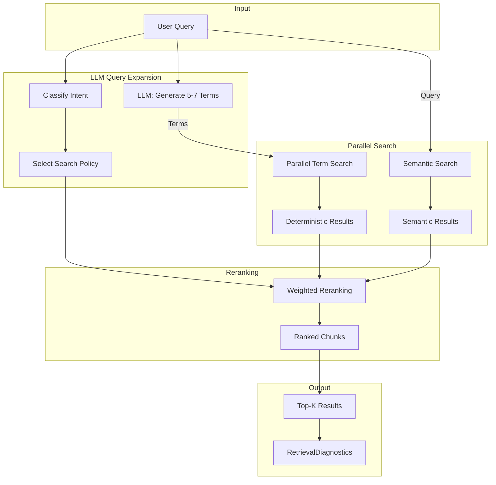

# Hybrid Parallel Retrieval Architecture

## Overview

The hybrid retrieval system combines **deterministic graph-based search** with **semantic embedding search**, using LLM-powered query expansion to parallelize the deterministic path.



## Key Design Principles

### 1. Determinism First

The deterministic path (term-based search) provides:
- **Reproducibility**: Same query always produces same initial candidates
- **Debuggability**: Easy to trace why a chunk was retrieved
- **Speed**: Index lookups are O(1), no embedding computation

### 2. Parallel Query Expansion

Instead of sequential multi-hop traversal:
1. LLM generates multiple search terms upfront (5-7 terms)
2. All terms are searched in parallel
3. Results are combined with weighted scoring

This trades LLM latency (one call) for reduced search iterations.

### 3. Configurable Fusion

The reranker supports multiple strategies:
- **Weighted Sum**: `score = w_det * det_score + w_sem * sem_score`
- **Reciprocal Rank Fusion (RRF)**: Position-based combination
- **Max Score**: Take highest score from either path
- **Multiplicative**: Only score chunks found by both paths

## Architecture Components

### TraversalIndex
Pre-built indexes for O(1) anchor lookup:
- `term_to_chunks`: Token → chunk IDs
- `section_title_to_chunks`: Section path → chunk IDs
- `entity_to_chunks`: Entity ID → chunk IDs
- `tag_to_chunks`, `trait_to_chunks`: Metadata → chunk IDs

### ModelAdapter
Provider-agnostic LLM interface supporting:
- OpenAI (GPT-4o-mini, GPT-4o)
- Anthropic (Claude Haiku, Claude Sonnet)
- Google (Gemini Flash)
- Local models (via OpenAI-compatible API)

### QueryExpander
LLM-based query expansion with:
- Few-shot prompting (tunable examples)
- Intent-aware term generation
- Fallback to tokenized query terms

### ParallelSearch
Concurrent term search executor:
- Searches all expanded terms in parallel
- Computes chunk scores based on term coverage
- Applies anchor bonuses for original query matches

### Reranker
Score combination and reranking:
- Normalizes scores from both paths
- Applies configurable weights
- Adds bonuses for anchors and term coverage
- Supports multiple fusion strategies

### HybridRetriever
Unified pipeline orchestrator:
- Manages all components
- Produces `RetrievalDiagnostics` for observability
- Supports batch retrieval

## Configuration

### HybridConfig

```python
@dataclass
class HybridConfig:
    expansion_model: str = "gpt-4o-mini"
    expansion_terms: int = 7
    deterministic_weight: float = 0.5
    semantic_weight: float = 0.5
    anchor_bonus: float = 1.0
    term_coverage_bonus: float = 0.1
    top_k: int = 30
    enable_semantic: bool = True
    require_both_paths: bool = False
```

### Weight Tuning

Start with balanced weights (0.5, 0.5) and use grid search to find optimal:

| Weights (det, sem) | Use Case |
|--------------------|----------|
| (1.0, 0.0) | Deterministic only (debugging) |
| (0.8, 0.2) | Prefer deterministic |
| (0.5, 0.5) | Balanced |
| (0.2, 0.8) | Prefer semantic |
| (0.0, 1.0) | Semantic only (baseline) |

## Observability

### RetrievalDiagnostics

Every retrieval produces comprehensive diagnostics:

```python
@dataclass
class RetrievalDiagnostics:
    query: str
    intent: Intent
    expanded_terms: List[str]
    expansion_latency_ms: float
    expansion_tokens: int
    expansion_model: str
    deterministic_chunks_found: int
    deterministic_latency_ms: float
    terms_with_hits: int
    term_hit_rate: float
    semantic_chunks_found: int
    semantic_latency_ms: float
    overlap_count: int
    final_result_count: int
    total_latency_ms: float
    gold_analysis: Optional[Dict]  # If gold_chunk_ids provided
```

### Metrics

| Metric | Description |
|--------|-------------|
| **Recall@K** | Fraction of gold chunks in top-K (K=1,2,5,10,20,30) |
| **Full Recall@K** | 1 if ALL gold chunks in top-K, else 0 |
| **Per-Path Attribution** | Which path found each gold chunk |
| **Term Hit Rate** | Fraction of expanded terms that matched chunks |
| **Expansion Quality** | Precision of expanded terms for finding gold |

## Experimentation

### Grid Search

```python
from experiments import ExperimentRunner, GridSearchConfig

runner = ExperimentRunner(index, queries)
grid_config = GridSearchConfig(
    weight_pairs=[(1.0, 0.0), (0.5, 0.5), (0.0, 1.0)],
    models=["gpt-4o-mini", "claude-haiku"],
)
runs = runner.run_grid_search(grid_config)
```

### Model Comparison

```python
runs = runner.compare_models([
    "gpt-4o-mini",  # Fast, cheap
    "gpt-4o",       # Higher quality
    "claude-haiku", # Alternative
])
```

## Usage Examples

### Basic Retrieval

```python
from traversal import (
    TraversalIndex,
    HybridConfig,
    HybridRetriever,
)

# Load index
index = TraversalIndex.build(graph, chunks)

# Create retriever
config = HybridConfig(
    expansion_model="gpt-4o-mini",
    deterministic_weight=0.6,
    semantic_weight=0.4,
)
retriever = HybridRetriever(index, config)

# Retrieve
result = retriever.retrieve("What does flat-footed do?")

# Access results
for chunk in result.get_top_k(10):
    print(f"{chunk.rank}. {chunk.chunk_id}: {chunk.final_score:.2f}")

# Check diagnostics
print(f"Expansion took {result.diagnostics.expansion_latency_ms:.0f}ms")
print(f"Found {result.diagnostics.deterministic_chunks_found} chunks")
```

### With Gold Chunks (Evaluation)

```python
gold_ids = {"chunk-123", "chunk-456"}
result = retriever.retrieve(
    "What does flat-footed do?",
    gold_chunk_ids=gold_ids,
)

# Check recall
recall = retriever.compute_recall_at_k(result, gold_ids)
print(f"Recall@10: {recall[10]:.1%}")

# Check attribution
attr = result.diagnostics.gold_analysis
print(f"Gold found by deterministic only: {attr['gold_from_deterministic_only']}")
```

## File Structure

```
RulesIngestion/
├── traversal/
│   ├── __init__.py          # Package exports
│   ├── model_adapter.py     # LLM provider abstraction
│   ├── expander.py          # Query expansion
│   ├── parallel_search.py   # Term search
│   ├── reranker.py          # Score combination
│   ├── hybrid_retriever.py  # Unified pipeline
│   ├── index.py             # TraversalIndex
│   ├── intent.py            # Intent classification
│   ├── policy.py            # Traversal policies
│   └── ...
├── experiments/
│   ├── __init__.py          # Package exports
│   ├── metrics.py           # Evaluation metrics
│   ├── hybrid_tuning.py     # Grid search framework
│   └── dashboard.py         # Report generation
└── Docs/
    └── HYBRID_RETRIEVAL.md  # This document
```

## Tuning Recommendations

### Starting Configuration

```python
config = HybridConfig(
    expansion_model="gpt-4o-mini",  # Start cheap
    deterministic_weight=0.5,       # Start balanced
    semantic_weight=0.5,
    anchor_bonus=1.0,
    term_coverage_bonus=0.1,
    top_k=30,
)
```

### Iteration Strategy

1. **Baseline**: Run with balanced weights, measure Recall@K
2. **Weight Grid**: Test [0.0, 0.2, 0.4, 0.6, 0.8, 1.0] for deterministic
3. **Model Test**: Compare gpt-4o-mini vs claude-haiku
4. **Bonus Tuning**: Adjust anchor_bonus and term_coverage_bonus
5. **Few-Shot Tuning**: Update examples in `expander.py` based on errors

### Interpreting Results

| Observation | Likely Cause | Action |
|-------------|--------------|--------|
| Low Recall@10, high @30 | Good coverage, poor ranking | Tune weights |
| Low Recall everywhere | Missing terms in expansion | Update few-shot examples |
| Det-only finds most gold | Semantic not adding value | Increase det_weight |
| Sem-only finds most gold | Expansion missing terms | Improve expansion |
| High latency | Large expansion model | Use gpt-4o-mini or local |

## Integration with RulesLawyer

To use hybrid retrieval in the RulesLawyer service:

```python
# In DungeonMindServer/ruleslawyer/hybrid_retriever.py

from RulesIngestion.traversal import (
    TraversalIndex,
    HybridConfig,
    HybridRetriever,
)

def create_semantic_search_fn(embedding_service):
    """Create semantic search function for hybrid retrieval."""
    def semantic_search(query: str, k: int) -> List[Dict]:
        results = embedding_service.search(query, k)
        return [
            {"chunk_id": r.id, "chunk": r.metadata, "semantic_score": r.score}
            for r in results
        ]
    return semantic_search

# Usage
config = HybridConfig(
    semantic_search_fn=create_semantic_search_fn(embedding_service),
    enable_semantic=True,
)
retriever = HybridRetriever(index, config)
```

## Experiment Findings (January 2026)

### Baseline Results

First experiments with 6 blind evaluation queries (gpt-5.2, deterministic only):

| Metric | Value | Notes |
|--------|-------|-------|
| Recall@1 | 0% | No perfect first-hit |
| Recall@5 | 2.8% | ~1 gold chunk in top 5 |
| Recall@10 | 8.3% | ~2-3 gold chunks in top 10 |
| Recall@30 | 13.9% | 4/28 gold chunks found |
| Avg Latency | 1575ms | Acceptable |

### Root Cause: Term Frequency Dominance

The low recall is caused by common terms dominating the scoring:

```
Gold chunk: "COVERING FIRE [one-action] OR [two-actions] FEAT 6"
Expanded terms: ["Covering Fire feat", "I'll Be Back feat", ...]

Token frequencies:
  - "feat": 1184 chunks (very common)
  - "fire": 270 chunks
  - "covering": 9 chunks (rare, specific)

Problem: All tokens scored equally (1.0)
Result: Generic "feat" chunks outrank specific "Covering Fire" chunk
```

### Identified Improvements

1. **IDF Weighting (Priority 1)**
   - Rare terms should score higher: `covering` = 7.86, `feat` = 2.98
   - Formula: `IDF(term) = log(N / df(term))`

2. **N-Gram Phrase Matching (Priority 2)**
   - Match "covering_fire" as bigram, not separate words
   - Phrase matches get bonus multiplier

3. **Semantic Search Integration (Priority 3)**
   - Embedding-based search for context beyond keywords
   - Combine with deterministic via configurable weights

### Next Steps

See: `Handoffs/HANDOFF-Hybrid-Retrieval-Scoring-Improvements.md`

## Future Enhancements

1. **IDF-Weighted Scoring**: Prioritize rare, specific terms (in progress)
2. **N-Gram Phrase Matching**: Match multi-word phrases (in progress)
3. **Streaming Results**: Return chunks as they're found
4. **Adaptive Weights**: Learn weights per intent
5. **Expansion Caching**: Cache common query expansions
6. **Cross-Encoder Reranking**: Use cross-encoder for final reranking
7. **Chunk Fusion**: Merge adjacent chunks for better context
