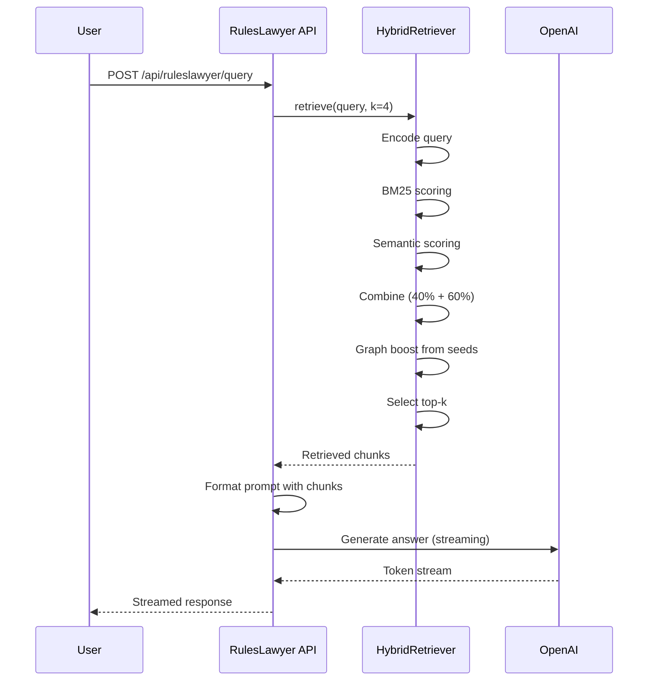

# Retrieval End-to-End

**Last Updated:** 2026-01-27  
**Status:** Canonical Reference

---

## Overview

This document describes how ingested data flows from RulesIngestion outputs to query-time retrieval in RulesLawyer. It covers the data handoff format, hybrid retrieval algorithm, graph boost mechanics, and current limitations.

---

## Data Handoff: RulesIngestion → RulesLawyer

### Storage Architecture

RulesIngestion stores all retrieval artifacts in MongoDB, eliminating manual file-based handoffs:

```
MongoDB Collections:
├── enriched_chunks      # Chunk content and metadata
├── chunk_embeddings     # Vector embeddings per chunk/model
├── graph_edges          # Graph edge definitions
├── graph_nodes          # Graph node definitions (optional)
├── traversal_configs    # Per-ruleset game terms and policies
└── traversal_indexes    # Index build metadata (not full index)
```

### Ingestion Pipeline Output

When running with `--store-mongodb`, the pipeline:
1. Enriches chunks (deterministic classification, tags, traits)
2. Generates embeddings using specified model
3. Builds graph (nodes + edges)
4. Stores all artifacts to MongoDB

```bash
# Full pipeline with MongoDB storage
uv run python ingest.py \
  --ruleset StarFinder2e \
  --book PlayerCore \
  --profile full \
  --store-mongodb \
  --generate-embeddings \
  --embedding-model nomic-embed-text-v2
```

### MongoDB Schemas

**Enriched Chunks:**
```javascript
db.enriched_chunks: {
  _id: ObjectId,
  chunk_id: string,           // Unique identifier
  ruleset_id: string,         // e.g., "sf2e-playercore"
  book_id: string,            // e.g., "playercore"
  run_id: string,             // Pipeline run ID
  text: string,               // Plain text content
  page: int,                  // Source page number
  content_kind: string,       // spell|feat|item|rule|narrative|table
  tags: array<string>,
  traits: array<string>,
  section_path: array<string>,
  is_rule_bearing: boolean
}
```

**Chunk Embeddings:**
```javascript
db.chunk_embeddings: {
  _id: ObjectId,
  chunk_id: string,           // Reference to enriched chunk
  ruleset_id: string,
  book_id: string,
  model_id: string,           // e.g., "nomic-embed-text-v2"
  embedding: array<float>,    // 1024-dim vector
  metadata: {
    text_hash: string,        // SHA256 for cache invalidation
    created_at: datetime
  }
}

// Indexes
db.chunk_embeddings.createIndex({ ruleset_id: 1, book_id: 1, model_id: 1 })
db.chunk_embeddings.createIndex({ chunk_id: 1, model_id: 1 }, { unique: true })
```

**Graph Edges:**
```javascript
db.graph_edges: {
  _id: ObjectId,
  source_id: string,
  target_id: string,
  relation: string,           // contains, next, describes, has_trait, etc.
  ruleset_id: string,
  book_id: string,
  metadata: object            // Edge-specific payload
}

// Indexes
db.graph_edges.createIndex({ ruleset_id: 1, book_id: 1 })
db.graph_edges.createIndex({ source_id: 1 })
db.graph_edges.createIndex({ target_id: 1 })
```

**Traversal Configs:**
```javascript
db.traversal_configs: {
  _id: ObjectId,
  ruleset_id: string,           // e.g., "StarFinder2e"
  version: string,              // e.g., "v1"
  condition_names: array<string>,  // Priority game terms
  spell_names: array<string>,
  feat_names: array<string>,
  item_names: array<string>,
  action_names: array<string>,
  player_keywords: array<string>,  // Document selection
  gm_keywords: array<string>,
  intent_patterns: object,      // Regex patterns per intent
  policies: object,             // Traversal policies per intent
  created_at: datetime,
  updated_at: datetime
}

// Indexes
db.traversal_configs.createIndex({ ruleset_id: 1, version: -1 }, { unique: true })
db.traversal_indexes.createIndex({ ruleset_id: 1, book_id: 1, run_id: 1 }, { unique: true })
```

### Legacy File Output (Optional)

For debugging/evaluation, files are still written to disk:
```
Rules/{Ruleset}/{Book}/outputs/runs/{timestamp}/enriched/
├── {doc-id}.enriched.json      # Enriched chunks
├── {doc-id}.graph.json         # Graph structure
├── {doc-id}.evaluation_queries.json  # Test queries
├── merged.enriched.json        # All documents merged
└── merged.graph.json           # Cross-document graph
```

---

## RulesLawyer Initialization

### MongoEmbeddingLoader

At startup, RulesLawyer loads from MongoDB:

```python
class MongoEmbeddingLoader:
    def __init__(
        self,
        ruleset_id: str,
        book_id: str,
        model_id: str = "nomic-embed-text-v2",
        mongo_uri: str = None
    ):
        self.db = get_mongo_client(mongo_uri)
        self.model = SentenceTransformer(model_id)
        
        # 1. Load enriched chunks
        chunks_cursor = self.db.enriched_chunks.find({
            "ruleset_id": ruleset_id,
            "book_id": book_id
        })
        self.chunks = list(chunks_cursor)
        self.chunk_ids = [c["chunk_id"] for c in self.chunks]
        self.chunk_id_to_index = {cid: i for i, cid in enumerate(self.chunk_ids)}
        
        # 2. Load embeddings as numpy array
        embeddings_cursor = self.db.chunk_embeddings.find({
            "ruleset_id": ruleset_id,
            "book_id": book_id,
            "model_id": model_id
        })
        embeddings_by_id = {doc["chunk_id"]: doc["embedding"] for doc in embeddings_cursor}
        
        # Align embeddings with chunk order
        self.embeddings = np.array([
            embeddings_by_id.get(cid, np.zeros(1024))
            for cid in self.chunk_ids
        ])
        
        # 3. Build graph adjacency from edges
        edges_cursor = self.db.graph_edges.find({
            "ruleset_id": ruleset_id,
            "book_id": book_id
        })
        self.graph_adjacency = self._build_adjacency(edges_cursor)
    
    def _build_adjacency(self, edges) -> Dict[str, Set[str]]:
        adjacency = {}
        for edge in edges:
            source, target = edge["source_id"], edge["target_id"]
            adjacency.setdefault(source, set()).add(target)
            adjacency.setdefault(target, set()).add(source)
        return adjacency
```

### TraversalConfig Loading

For traversal-only retrieval, load the config from MongoDB:

```python
from traversal import TraversalConfig, TraversalIndex, retrieve_candidates

# Load config from MongoDB
config = TraversalConfig.load_from_mongo(
    ruleset_id="StarFinder2e",
    mongo_uri="mongodb://localhost:27017",
)

# Build index from graph and chunks (in-memory)
index = TraversalIndex.build(graph_data, enriched_chunks)

# Use in retrieval
result = retrieve_candidates(
    query="What happens when I'm grabbed?",
    index=index,
    config=config,
)
print(f"Candidates: {len(result.candidates)}")
```

### Benefits of MongoDB Loading

- **No file management** - No CSV/JSON files to copy between services
- **Version control** - Multiple embedding models stored per corpus
- **Incremental updates** - Re-embed only changed chunks
- **Cross-service access** - RulesIngestion writes, RulesLawyer reads
- **Query flexibility** - Filter by ruleset, book, model at load time

---

## Hybrid Retrieval Algorithm

### Overview

RulesLawyer uses a three-stage hybrid retrieval:

```
Query
  ↓
[Stage 1: Lexical + Semantic Scoring]
  ↓
[Stage 2: Graph Boost]
  ↓
[Stage 3: Top-K Selection]
  ↓
Retrieved Chunks
```

### Stage 1: Base Scoring

**Module:** `hybrid_retriever.py`

#### Lexical Scoring (BM25)

```python
def _lexical_scores(self, query: str) -> np.ndarray:
    """BM25 scoring for keyword matching."""
    query_tokens = self._tokenize(query)
    scores = np.zeros(len(self.documents))
    
    for token in query_tokens:
        if token not in self.idf:
            continue
        idf = self.idf[token]
        for doc_idx, doc_tokens in enumerate(self.doc_tokens):
            tf = doc_tokens.count(token)
            doc_len = len(doc_tokens)
            # BM25 formula
            score = idf * (tf * (self.k1 + 1)) / (
                tf + self.k1 * (1 - self.b + self.b * doc_len / self.avg_doc_len)
            )
            scores[doc_idx] += score
    
    return scores
```

**Parameters:**
- `k1 = 1.5` - Term frequency saturation
- `b = 0.75` - Document length normalization

#### Semantic Scoring (Embeddings)

```python
def _semantic_scores(self, query: str) -> np.ndarray:
    """Cosine similarity with query embedding."""
    query_embedding = self.model.encode(query)
    return self.embeddings @ query_embedding  # Dot product = cosine sim (normalized)
```

#### Score Combination

```python
def _combined_scores(self, query: str) -> np.ndarray:
    lexical = self._lexical_scores(query)
    semantic = self._semantic_scores(query)
    
    # Min-max normalization
    lexical_norm = (lexical - lexical.min()) / (lexical.max() - lexical.min() + 1e-9)
    semantic_norm = (semantic - semantic.min()) / (semantic.max() - semantic.min() + 1e-9)
    
    # Weighted combination
    return lexical_norm * 0.4 + semantic_norm * 0.6
```

**Default weights:**
- Lexical (BM25): **40%**
- Semantic (embeddings): **60%**

### Stage 2: Graph Boost

Graph boost improves retrieval by promoting chunks connected to top-scoring seeds.

```python
def _apply_graph_boost(
    self,
    scores: np.ndarray,
    seed_k: int = 12,
    depth: int = 1,
    boost: float = 0.05,
    decay: float = 0.5,
) -> np.ndarray:
    """Boost scores for graph neighbors of top seeds."""
    
    # Get top-scoring chunks as seeds
    seed_indices = np.argsort(scores)[::-1][:seed_k]
    seed_ids = [self.chunk_ids[i] for i in seed_indices]
    
    # BFS traversal from seeds
    boosted = np.zeros_like(scores)
    for seed_id in seed_ids:
        visited = {seed_id}
        frontier = {seed_id}
        
        for d in range(1, depth + 1):
            next_frontier = set()
            for node_id in frontier:
                for neighbor in self.graph_adjacency.get(node_id, set()):
                    if neighbor in visited:
                        continue
                    visited.add(neighbor)
                    next_frontier.add(neighbor)
                    
                    # Apply boost with decay
                    idx = self.chunk_id_to_index.get(neighbor)
                    if idx is not None:
                        boosted[idx] += boost * (decay ** (d - 1))
            
            frontier = next_frontier
    
    return scores + boosted
```

**Recommended parameters (from experiments):**
- `graph_boost_source = "top"` - Seed from top-scoring chunks
- `graph_boost_seed_top_n = 3` - Number of seeds
- `graph_boost_depth = 2` - Traversal depth
- `graph_boost_top_k = 50` - Limit boost candidates
- `graph_boost_decay = 0.4` - Score decay per depth

### Stage 3: Top-K Selection

```python
def retrieve(self, query: str, k: int = 4) -> List[Dict]:
    # Combined scoring
    scores = self._combined_scores(query)
    
    # Graph boost
    scores = self._apply_graph_boost(scores)
    
    # Select top-k
    top_indices = np.argsort(scores)[::-1][:k]
    
    results = []
    for idx in top_indices:
        results.append({
            "chunk": self.pages_and_chunks[idx],
            "score": float(scores[idx]),
            "base_score": float(self._combined_scores(query)[idx]),
            "graph_boost": float(scores[idx] - self._combined_scores(query)[idx]),
        })
    
    return results
```

---

## Query-to-Answer Flow

### Complete Flow Diagram



### Prompt Construction

```python
def format_prompt(query: str, chunks: List[Dict], page_summaries: Dict) -> str:
    context_parts = []
    
    for chunk in chunks:
        page = chunk["page"]
        summary = page_summaries.get(str(page), "")
        
        context_parts.append(f"""
Page {page}:
{summary}

Content:
{chunk["text"]}
""")
    
    context = "\n---\n".join(context_parts)
    
    return f"""You are a TTRPG rules expert. Answer the question using ONLY the provided context.

Context:
{context}

Question: {query}

Answer:"""
```

### Streaming Response

The API streams tokens with progress events:

```python
async def query_stream(query: str):
    yield {"event": "search", "data": "Searching rulebooks..."}
    
    chunks = retriever.retrieve(query)
    yield {"event": "context", "data": f"Found {len(chunks)} relevant passages"}
    
    prompt = format_prompt(query, chunks)
    yield {"event": "generation", "data": "Generating answer..."}
    
    async for token in openai_stream(prompt):
        yield {"event": "token", "data": token}
    
    yield {"event": "complete", "data": "Done"}
```

---

## Evaluation Metrics

### Terminology Clarification

| Metric | What It Measures |
|--------|------------------|
| **Evaluability** (formerly "coverage") | Fraction of queries where expected chunk exists in corpus |
| **hit@k** | Fraction of evaluated queries where gold chunk appears in top-k |
| **MRR** | Mean reciprocal rank of first gold hit |
| **Cross-book contamination** | Fraction of top-k from wrong books |
| **Answer similarity** | Embedding similarity between retrieved chunks and reference answer |

### Evaluation Harness

```bash
cd DungeonMindServer

uv run python -m ruleslawyer.evaluation_harness \
  --queries-dir "path/to/evaluation_queries.json" \
  --model-id nomic-embed-text-v2 \
  --best-practice-eval \
  --best-practice-boost \
  --report-dir "path/to/reports"
```

**Best-practice flags:**
- `--best-practice-eval` - Standard evaluation settings
- `--best-practice-boost` - Recommended graph boost parameters
- `--expand-gold` - Include graph-expanded expected chunks
- `--chapter-routing-report` - Evaluate chapter routing

---

## Current Limitations

### 1. Graph Boost Provides Limited Lift

**Finding:** Graph boost improves MRR when seeded from top results, but expanded gold (graph-adjacent chunks as alternative answers) shows minimal improvement.

**Evidence (from handoff):**
- Expanded gold deltas: ~0.004-0.007 MRR
- Graph neighbors are "not relevant enough to affect rank"
- Most additions are `graph_depth_1` (immediate neighbors)

**Implication:** The graph captures structural relationships but not semantic relevance. Neighbors are adjacent in document order, not necessarily related in meaning.

### 2. Alias Normalization Alone Doesn't Help

**Finding:** Alias resolution (AC → Armor Class) doesn't improve retrieval ranks.

**Evidence:** MRR unchanged with alias normalization enabled vs disabled.

**Implication:** Entity linking helps graph construction but doesn't directly improve embedding similarity.

### 3. Chapter Routing Trades Coverage for MRR

**Finding:** Restricting retrieval to relevant chapters improves precision but reduces recall.

| top_n | Evaluability | MRR | hit@1 |
|-------|--------------|-----|-------|
| 3 | 0.39 | 0.85 | 0.80 |
| 8 | 0.59 | 0.81 | 0.75 |
| 12 | 0.70 | 0.79 | 0.73 |

**Implication:** Use chapter routing when precision matters more than recall.

### 4. ~~Manual Data Handoff~~ (RESOLVED)

**Status:** Addressed by MongoDB storage architecture.

With `--store-mongodb` and `--generate-embeddings`, the pipeline:
- Generates embeddings during ingestion
- Stores chunks, embeddings, and graphs in MongoDB
- RulesLawyer loads directly from MongoDB at startup

See [CLEANUP_RECOMMENDATIONS.md](CLEANUP_RECOMMENDATIONS.md) for implementation details.

### 5. Embedding Model Selection

**Current default:** `BAAI/bge-m3` (1024 dimensions)

**Alternative tested:** `nomic-embed-text-v2` - Similar MRR, faster inference

**Recommendation:** Use `nomic-embed-text-v2` for production; consider fine-tuning on TTRPG corpus.

---

## Recommended Improvements

### Short-term (Completed via MongoDB Architecture)

1. ~~**Integrate embedding generation**~~ - Done via `--generate-embeddings` flag
2. ~~**Document handoff schema**~~ - Done in ARCHITECTURE.md
3. ~~**Add validation**~~ - Addressed by MongoDB schema constraints

### Medium-term

1. **Semantic similarity edges** - Store edges for chunks with embedding similarity > threshold
2. **Graph-first filtering** - Entity-linked nodes → vector search on subset
3. **Fine-tune embedding model** on TTRPG evaluation queries
4. **Cross-reference edges** - Extract "see Fireball spell" links

### Long-term

1. **Graph embeddings** (Node2Vec/GraphSAGE) as rerank signal
2. **Relation extraction expansion** (explicit `requires_level`, `grants_ability`)
3. **Hybrid routing** (combine chapter routing with semantic fallback)
4. **Vector database** - Consider migrating embeddings to purpose-built vector DB for scale

---

## Related Documents

- [Architecture](ARCHITECTURE.md) - System overview and module map
- [Ingestion Pipeline](INGESTION_PIPELINE.md) - How data is ingested
- [Cleanup Recommendations](CLEANUP_RECOMMENDATIONS.md) - Technical debt and improvements
- [Graph Retrieval Enhancement Handoff](../Handoffs/HANDOFF-Graph-Retrieval-Enhancement.md) - Experiment results
