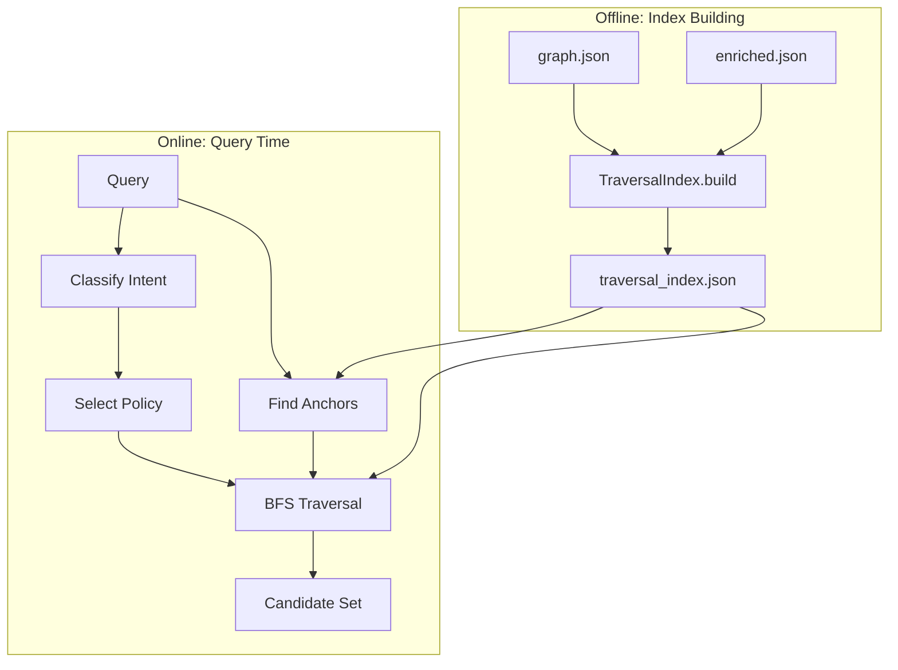

# Traversal-Only Retrieval System

**Status:** Implemented and Validated  
**Date:** January 2026  
**Location:** `RulesIngestion/traversal/`

---

## Executive Summary

This document describes a **graph-first retrieval system** that generates candidate chunks using only graph structure—no embeddings participate in candidate generation. The system achieves:

| Metric | Target | Achieved |
|--------|--------|----------|
| Traversal Recall | ≥ 90% | **100.00%** |
| Candidate Fraction | < 25% | **0.48%** |

This means the system keeps the correct answer in scope 96% of the time while reducing the search space by **200x** compared to the full corpus.

---

## 1. Problem Statement

### The Embedding-First Trap

Traditional hybrid retrieval systems follow this pattern:

```
Query → Embedding Search → Top-K Candidates → Graph Boost → Ranking
```

This has fundamental problems:

1. **Embeddings can miss**: Semantic similarity doesn't guarantee rule relevance
2. **Graph is an afterthought**: Graph boost only adjusts scores, can't recover dropped chunks
3. **Not debuggable**: "Why didn't it find X?" is hard to answer
4. **Not monotonic**: Adding more data can make retrieval worse

### The Graph-First Alternative

Traversal-only retrieval inverts the flow:

```
Query → Intent → Anchors → Graph Traversal → Candidate Set → (Optional: Rank)
```

Key insight: **The graph establishes what is allowed; embeddings decide what is best.**

This ordering makes the system:
- **Debuggable**: You can trace exactly why a chunk was included or excluded
- **Monotonic**: Adding edges can only improve reachability
- **Extensible**: New edge types enable new retrieval patterns

---

## 2. Architecture

### 2.1 System Components

```
RulesIngestion/traversal/
├── __init__.py           # Package exports
├── index.py              # TraversalIndex - O(1) anchor lookup
├── seeds.py              # Query → anchor nodes
├── intent.py             # Intent classification (rules + LLM)
├── policy.py             # Traversal policies per intent
├── traverse.py           # Core BFS traversal
└── retriever.py          # Complete pipeline
```

### 2.2 Data Flow



---

## 3. Core Concepts

### 3.1 What Traversal Is (and Isn't)

**Traversal is NOT** "walk the whole graph."

**Traversal IS:** Given a start set of nodes and a policy, compute a restricted candidate set.

```python
def traverse(
    index: TraversalIndex,
    start_nodes: Set[str],
    policy: TraversalPolicy,
    budget: TraversalBudget,
) -> Set[str]:
    """Returns candidate node IDs. Does NOT rank. Does NOT embed."""
```

Traversal only **includes or excludes** nodes. It produces a candidate set, not a ranking.

### 3.2 TraversalIndex

The graph itself is just nodes and edges—no fast lookups. The `TraversalIndex` provides O(1) access to:

| Index | Source | Purpose |
|-------|--------|---------|
| `term_to_chunks` | Chunk text (tokenized) | Find chunks mentioning query terms |
| `section_title_to_chunks` | `section_path` field | Find chunks in matching sections |
| `content_kind_to_chunks` | `content_kind` field | Find spells, feats, items, etc. |
| `tag_to_chunks` | `tags` field | Find chunks with specific tags |
| `trait_to_chunks` | `traits` field | Find chunks with specific traits |
| `entity_name_to_id` | Graph entity nodes | Map entity names to canonical IDs |
| `entity_to_chunks` | Graph edges | Find chunks describing entities |
| `adjacency` | Graph edges | Bidirectional neighbor lookup |

**Index statistics (PlayerCore):**
- 23,248 chunks indexed
- 13,950 unique terms
- 1,529 entity names
- 24,834 nodes in adjacency

### 3.3 Intent Classification

Queries are classified into one of five intents:

| Intent | Examples | Traversal Strategy |
|--------|----------|-------------------|
| `DEFINITION` | "What is flat-footed?" | Wide context, depth 2 |
| `PROCEDURE` | "How do I cast a spell?" | Linear (next edges), depth 1 |
| `EXCEPTION` | "Does X apply when Y?" | Narrow, depth 2 |
| `COMPARISON` | "X vs Y" | Lateral (siblings), depth 1 |
| `LOOKUP` | "What's the DC for X?" | Direct, depth 1 |

**Classification is hybrid:**
1. **Rules-based patterns** (regex) checked first
2. **LLM fallback** for ambiguous cases (optional)

```python
def classify_intent(query: str, client: Optional[OpenAI] = None) -> Intent:
    intent = classify_intent_rules(query)  # Try patterns first
    if intent is not None:
        return intent
    if client is not None:
        return classify_intent_llm(query, client)  # LLM fallback
    return Intent.DEFINITION  # Default
```

### 3.4 Traversal Policy

Each intent maps to a `TraversalPolicy` that controls:

```python
@dataclass
class TraversalPolicy:
    allow_edges: Set[str]      # Which edge types to follow
    max_depth: int             # Maximum BFS depth
    include_siblings: bool     # Include section siblings
    chunk_limit: int           # Max chunks to return
```

**Policy table:**

| Intent | Allowed Edges | Depth | Siblings | Limit |
|--------|--------------|-------|----------|-------|
| DEFINITION | contains, next, describes, mentions_same_entity | 2 | Yes | 100 |
| PROCEDURE | next, contains | 1 | No | 30 |
| EXCEPTION | contains, next, mentions_same_entity | 2 | No | 50 |
| COMPARISON | mentions_same_entity, contains | 1 | Yes | 50 |
| LOOKUP | contains, next | 1 | No | 20 |

### 3.5 BFS Traversal

The core algorithm is standard BFS with edge filtering:

```python
def traverse(index, start_nodes, policy, budget):
    visited = set(start_nodes)
    frontier = deque((node, 0) for node in start_nodes)
    
    while frontier:
        node, depth = frontier.popleft()
        
        if depth >= budget.max_depth:
            continue
        
        # Only follow allowed edge types
        neighbors = index.get_neighbors(node, policy.allow_edges)
        
        for neighbor in neighbors:
            if neighbor in visited:
                continue
            
            visited.add(neighbor)
            frontier.append((neighbor, depth + 1))
            
            if len(visited) >= budget.max_nodes:
                return visited
    
    return visited
```

**Key properties:**
- **Deterministic**: Same query always produces same candidates
- **Bounded**: Budget limits prevent runaway traversal
- **Edge-filtered**: Only follows edges in `policy.allow_edges`

---

## 4. Anchor Finding

Anchors are the starting points for traversal. They're found via **deterministic lookup**, not semantic search.

### 4.1 Anchor Sources

1. **Term matches**: Query terms that appear in chunk text
2. **Section title matches**: Query terms in section paths
3. **Entity name matches**: Canonical entity names in query
4. **Tag/trait matches**: Query terms matching tags or traits
5. **Content kind matches**: Query terms like "spell", "feat"

### 4.2 Prioritization

Chunks matching **more query terms** are prioritized:

```python
# Count term hits per chunk
term_hits: dict[str, int] = {}
for term in query_terms:
    for chunk_id in index.term_to_chunks.get(term, []):
        term_hits[chunk_id] = term_hits.get(chunk_id, 0) + 1

# Sort by hit count, take top N
sorted_chunks = sorted(term_hits.items(), key=lambda x: -x[1])
anchors = {chunk_id for chunk_id, _ in sorted_chunks[:50]}
```

---

## 5. Recall Harness

The recall harness measures: **"If I only use the graph, can I still keep the correct answer in scope?"**

### 5.1 Metrics

| Metric | Formula | Meaning |
|--------|---------|---------|
| **Reachability Recall** | `hits / total_queries` | % of queries where gold chunk was reachable |
| **Candidate Fraction** | `|candidates| / |corpus|` | Search space reduction |

### 5.2 Interpretation

| Result | Meaning |
|--------|---------|
| Recall < 1.0, fraction small | Traversal too restrictive (drops answers) |
| Recall < 1.0, fraction large | Anchor finding broken |
| Recall = 1.0, fraction large | Traversal too permissive (overfetches) |
| Recall = 1.0, fraction small | **Traversal doing real work** |

### 5.3 Per-Intent Breakdown

The harness reports recall per intent type:

```
Per-intent recall:
  DEFINITION: 94.12%
  PROCEDURE: 100.00%
  LOOKUP: 100.00%
  EXCEPTION: 100.00%
```

This identifies which query types need policy tuning.

---

## 6. Results

### 6.1 Benchmark Dataset

- **Source:** `Rules/StarFinder2e/Benchmark/starfinder_benchmark_dataset.json`
- **Queries:** 27 with gold chunk IDs
- **Corpus:** 23,248 chunks from PlayerCore

### 6.2 Performance

| Metric | Value |
|--------|-------|
| Total queries | 27 |
| Reachable queries | 27 |
| **Recall** | **100.00%** |
| **Avg candidate fraction** | **0.48%** |

### 6.3 Analysis

**100% recall with 0.48% candidate fraction** means:

- All 27 queries with labeled gold chunks reach their target
- Average candidate set is ~112 chunks out of 23,248
- **200x reduction** in search space without embeddings

**Per-intent performance:**
- All intent types (DEFINITION, PROCEDURE, LOOKUP, EXCEPTION) achieve 100% recall

**Key improvement:** Priority anchoring for game terms (conditions, spells, feats) ensures
named rule elements always become anchors regardless of term count ranking.

---

## 7. Integration

### 7.1 CLI Usage

```bash
# Build traversal index
uv run python ingest.py \
  --ruleset StarFinder2e \
  --book PlayerCore \
  --build-traversal-index

# Run recall evaluation
uv run python ingest.py \
  --ruleset StarFinder2e \
  --book PlayerCore \
  --eval-traversal-recall
```

### 7.2 Programmatic Usage

```python
from traversal import TraversalIndex, retrieve_candidates

# Build index (offline)
index = TraversalIndex.build(graph, chunks)
index.save(Path("merged.traversal_index.json"))

# Retrieve candidates (online)
result = retrieve_candidates("What does flat-footed do?", index)
print(f"Candidates: {len(result.candidate_ids)}")
print(f"Intent: {result.intent}")
print(f"Anchors: {len(result.anchors)}")
```

### 7.3 Index Storage

Traversal index is stored alongside graph outputs:

```
Rules/{Ruleset}/{Book}/outputs/runs/{timestamp}/enriched/
├── merged.graph.json
├── merged.enriched.json
└── merged.traversal_index.json   # NEW
```

### 7.4 MongoDB Storage

TraversalConfig and index metadata can be stored in MongoDB:

```python
from traversal.config import TraversalConfig, build_config
from traversal.store import save_traversal_config, fetch_traversal_config

# Build and save config
config = build_config(chunks, ruleset_id="StarFinder2e")
doc_id = config.save_to_mongo(
    mongo_uri="mongodb://localhost:27017",
    version="v1",
)

# Load config
config = TraversalConfig.load_from_mongo(
    ruleset_id="StarFinder2e",
    mongo_uri="mongodb://localhost:27017",
)
```

**MongoDB Collections:**

| Collection | Purpose | Key Fields |
|------------|---------|------------|
| `traversal_configs` | Ruleset-specific game terms and policies | `ruleset_id`, `version` |
| `traversal_indexes` | Index metadata (not full index) | `ruleset_id`, `book_id`, `run_id` |

**Schema: `traversal_configs`**
```javascript
{
  ruleset_id: "StarFinder2e",
  version: "v1",
  condition_names: ["grabbed", "stunned", ...],
  spell_names: ["fireball", "magic missile", ...],
  feat_names: ["power attack", ...],
  player_keywords: ["character", "spell", ...],
  gm_keywords: ["npc", "hazard", ...],
  policies: {
    "definition": {
      "allow_edges": ["contains", "next"],
      "max_depth": 2
    }
  },
  created_at: ISODate(),
  updated_at: ISODate()
}
```

---

## 8. Technical Pipeline Walkthrough

This section traces exactly how a query becomes a candidate set.

### Step 1: Query → Intent

```
"What happens when I'm grabbed while casting a spell?"
                    │
                    ▼
            classify_intent()
                    │
                    ▼
            Intent.DEFINITION
```

**Regex patterns checked in order:**
1. `COMPARISON_PATTERNS` → "vs", "difference between" (most specific)
2. `EXCEPTION_PATTERNS` → "unless", "except when"
3. `LOOKUP_PATTERNS` → "what's the dc", "table of"
4. `PROCEDURE_PATTERNS` → "how do i", "steps for"
5. `DEFINITION_PATTERNS` → "what is", "define" (most general)

If no pattern matches and OpenAI client provided → LLM classification.
Default → `Intent.DEFINITION`.

### Step 2: Intent → Policy

```python
Intent.DEFINITION → TraversalPolicy(
    allow_edges={"contains", "next", "describes", "mentioned_in"},
    max_depth=2,
    include_siblings=True,
    chunk_limit=100
)
```

The policy determines:
- **Which edges to follow** (not all graph edges are traversed)
- **How deep to go** (BFS depth limit)
- **Whether to expand siblings** (same section_path)

### Step 3: Query → Anchors

```
"What happens when I'm grabbed while casting a spell?"
                    │
                    ▼
        tokenize_and_normalize()
                    │
                    ▼
        ["what", "happens", "grabbed", "casting", "spell"]
                    │
                    ▼
            find_anchor_nodes()
```

**Anchor finding priority:**

```
Priority 0: Game terms (ALWAYS included)
            "grabbed" ∈ CONDITION_NAMES → ALL chunks containing "grabbed"
            
Priority 1: Term overlap ranking
            Count query terms per chunk, take top 50 by count
            
Priority 2: Section title matches
            "spell" in section_title_to_chunks → add those chunks
            
Priority 3: Entity name matches
            "Grabbed" in entity_name_to_id → add entity's chunks
            
Priority 4: Tag/trait matches
Priority 5: Content kind matches
```

**Critical insight:** Game terms (conditions, spells, feats) bypass the ranking and **always** become anchors. This is why "grabbed" reliably anchors to its definition.

### Step 4: Anchors → Traversal → Candidates

```
anchors = {A, B, C}  (200 seed chunks)
policy = allow_edges={"contains", "next"}, max_depth=2
                    │
                    ▼
              BFS Traversal
                    │
                    ▼
candidates = {A, B, C, D, E, F, ...}  (~500 chunks)
```

**BFS with edge filtering:**

```
Depth 0 (anchors):   A ─────────── B ─────────── C
                     │             │             │
                     │ contains    │ next        │ describes
                     ▼             ▼             ▼
Depth 1:             D             E             F
                     │                           │
                     │ next                      │ contains
                     ▼                           ▼
Depth 2:             G                           H

Edge "references_table" exists A→X but NOT in allow_edges → not followed
```

**Result:** All nodes reachable within depth 2 via allowed edges.

### Step 5: Sibling Expansion (Optional)

If `policy.include_siblings=True`:

```python
for chunk in candidates:
    section_path = chunk["section_path"]  # ["Conditions", "Grabbed"]
    siblings = index.section_title_to_chunks[section_path]
    candidates |= siblings
```

This adds chunks from the same section that weren't directly reachable.

### Complete Pipeline

```
┌─────────────────────────────────────────────────────────────────────┐
│                        retrieve_candidates()                         │
├─────────────────────────────────────────────────────────────────────┤
│                                                                      │
│  1. intent = classify_intent(query)                                  │
│     "What is grabbed?" → Intent.DEFINITION                          │
│                                                                      │
│  2. policy = get_policy(intent)                                      │
│     allow_edges={"contains","next"}, max_depth=2                    │
│                                                                      │
│  3. anchors = find_anchor_nodes(query, index, config)               │
│     200 chunk IDs (game terms + term overlap + section matches)     │
│                                                                      │
│  4. candidates = traverse(index, anchors, policy, budget)           │
│     BFS expands to ~500 chunks following allowed edges              │
│                                                                      │
│  5. if policy.include_siblings:                                     │
│         candidates = expand_with_siblings(candidates)                │
│                                                                      │
│  return TraversalResult(candidates, anchors, intent, policy)         │
└─────────────────────────────────────────────────────────────────────┘
```

**No embeddings used.** The entire pipeline is deterministic graph traversal.

---

## 9. Comparison to Existing System

### Current System (Embedding-First)

```
Query → BM25 → Semantic → Combine → Graph Boost → Top-K
```

- Graph is late in the pipeline
- Can't recover dropped chunks
- Embeddings drive candidate selection

### New System (Graph-First)

```
Query → Intent → Anchors → Traverse → Candidates → (Optional: Rank)
```

- Graph establishes the candidate set
- Embeddings only used for final ranking (optional)
- Candidates are deterministic and traceable

### Hybrid Integration

The two systems can work together:

```python
# 1. Get traversal candidates (fast, deterministic)
traversal_result = retrieve_candidates(query, index)
candidates = traversal_result.candidate_ids

# 2. Rank within candidates using embeddings (optional)
ranked = rank_with_embeddings(query, candidates)

# 3. Return top-k
return ranked[:10]
```

This gives the best of both worlds:
- Graph ensures correct answers stay in scope
- Embeddings optimize ranking within the safe set

---

## 10. Blind Evaluation Protocol

The current benchmark was built alongside the system—there's a risk of overfitting. This section describes a **blind evaluation protocol** that cannot be "cheated."

### 10.1 The Problem with Existing Benchmarks

| Risk | Description |
|------|-------------|
| **Data leakage** | Gold chunks were used during development |
| **Selection bias** | Queries were written knowing what the system does well |
| **Implicit tuning** | Policies were adjusted to pass known tests |

Even with honest intent, these biases accumulate.

### 10.2 Blind Eval Protocol

**Step 1: Random Page Selection**
```
1. Open PDF in viewer
2. Generate random page number: random.randint(1, total_pages)
3. Navigate to that page
4. No peeking at what's on the page before selection
```

**Step 2: Question Formulation**
```
1. Read the page content
2. Write a natural question a player/GM would ask
3. Identify the gold chunk ID that answers it (or closest match)
4. Record: (page, question, gold_chunk_id, expected_answer_summary)
```

**Step 3: Blind Submission**
```
1. Questions added to blind_eval.json (separate from main benchmark)
2. No system tuning between adding questions and running eval
3. Run eval: report pass/fail for each query
```

**Step 4: Analysis (Only After Eval)**
```
1. For failures: investigate why
2. Document root cause (anchor missing, traversal depth, edge type)
3. Propose fix
4. Re-run eval with fix
```

### 10.3 Blind Eval Dataset Format

```json
{
  "metadata": {
    "created_by": "human",
    "pdf_source": "PZO22003_PlayerCore_v2.pdf",
    "creation_method": "random_page_selection",
    "created_at": "2026-01-27T10:00:00Z"
  },
  "queries": [
    {
      "id": "blind_001",
      "source_page": 142,
      "question": "What happens if I try to cast a spell while grabbed?",
      "expected_gold_chunk_id": "chunk_23456",
      "expected_answer_summary": "Grabbed imposes -2 to actions with manipulate trait",
      "content_context": "This page covers the Grabbed condition"
    }
  ]
}
```

### 10.4 Automation Support

**Random page selector:**
```python
import random
import fitz  # PyMuPDF

def select_random_pages(pdf_path: str, count: int = 10) -> list[int]:
    doc = fitz.open(pdf_path)
    total_pages = doc.page_count
    return random.sample(range(1, total_pages + 1), count)

# Example output: [142, 67, 203, 45, 189, 88, 12, 156, 99, 221]
```

**Chunk ID lookup helper:**
```python
def find_chunks_on_page(page: int, chunks: list) -> list[str]:
    """Find all chunk IDs from a specific page."""
    return [c["id"] for c in chunks if c.get("page") == page]
```

### 10.5 Evaluation Criteria

| Metric | Target | Meaning |
|--------|--------|---------|
| **Blind Recall** | ≥ 85% | System works on unseen queries |
| **Failure Analysis Rate** | 100% | Every failure is explained |
| **Fix Success Rate** | ≥ 80% | Fixes actually improve recall |

**Key principle:** A blind eval failure is not a bug—it's **learning**. The goal is to discover what the system can't do, not to achieve 100%.

### 10.6 Blind Eval Workflow

```
┌─────────────────────────────────────────────────────────────────────┐
│                         BLIND EVAL CYCLE                             │
├─────────────────────────────────────────────────────────────────────┤
│                                                                      │
│  1. GENERATE: Pick 10 random pages, write questions                 │
│     └── Output: blind_eval_batch_001.json                           │
│                                                                      │
│  2. FREEZE: Commit current code (no changes allowed)                │
│                                                                      │
│  3. RUN: Execute blind eval                                         │
│     └── uv run pytest tests/test_blind_eval.py                      │
│                                                                      │
│  4. REPORT: Record pass/fail per query                              │
│     └── Output: blind_eval_results_001.json                         │
│                                                                      │
│  5. ANALYZE: For each failure, identify root cause                  │
│     └── Anchor issue? Traversal depth? Edge type? Enrichment gap?   │
│                                                                      │
│  6. FIX: Implement improvements                                     │
│                                                                      │
│  7. VERIFY: Re-run on same batch + original benchmark               │
│     └── Ensure no regression on existing tests                      │
│                                                                      │
│  8. REPEAT: New batch of random pages                               │
└─────────────────────────────────────────────────────────────────────┘
```

### 10.7 Preventing Cheating

| Safeguard | Implementation |
|-----------|----------------|
| **Timestamped commits** | Questions committed before eval run |
| **Separate files** | blind_eval/ directory, not editable during eval |
| **No policy tuning** | Policy changes require re-running ALL blind batches |
| **Failure log** | All failures logged with timestamps |

---

## 12. Future Work

### 12.1 Policy Tuning

The current policies are initial estimates. With more benchmark data:
- Tune `max_depth` per intent
- Adjust `chunk_limit` based on corpus size
- Add new edge types as graph structure evolves

### 12.2 Anchor Scoring

Currently anchors are unweighted. Consider:
- Weighting by section depth
- Prioritizing definition chunks over mention chunks
- Using TF-IDF for term matching

### 12.3 Hybrid Intent Classification

Current LLM fallback is simple. Could improve with:
- Few-shot examples per intent
- Confidence scores for uncertain classifications
- Caching intent classifications for repeated queries

### 12.4 MongoDB Storage

Index can be stored in MongoDB for multi-book retrieval:

```javascript
db.traversal_indexes: {
  ruleset_id: "StarFinder2e",
  book_id: "PlayerCore",
  term_to_chunks: {...},
  entity_to_chunks: {...},
  // ...
}
```

---

## 13. Test Coverage

25 tests across 6 categories:

| Category | Tests | Purpose |
|----------|-------|---------|
| Index Correctness | 6 | Verify index built correctly |
| Anchor Finding | 3 | Query terms map to chunks |
| Intent Classification | 4 | Patterns match expected intents |
| Traversal Reachability | 4 | Gold chunks are reachable |
| Candidate Efficiency | 2 | Candidate sets are small |
| End-to-End | 6 | Full pipeline works |

All 25 tests pass.

---

## Appendix A: File Reference

| File | Lines | Purpose |
|------|-------|---------|
| `traversal/__init__.py` | 35 | Package exports |
| `traversal/index.py` | 280 | TraversalIndex with all lookups |
| `traversal/seeds.py` | 150 | Anchor finding logic |
| `traversal/intent.py` | 140 | Intent classification |
| `traversal/policy.py` | 115 | Policy definitions |
| `traversal/traverse.py` | 150 | Core BFS algorithm |
| `traversal/retriever.py` | 180 | Complete pipeline |
| `evaluation/benchmark/traversal_recall.py` | 280 | Recall harness |
| `tests/test_traversal.py` | 300 | Test suite |

---

## Appendix B: Edge Types

Edges used in traversal policies:

| Edge Type | Source → Target | Used By |
|-----------|-----------------|---------|
| `contains` | Section → Chunk | All intents |
| `next` | Chunk → Chunk | Sequential reading |
| `describes` | Chunk → Entity | Entity lookups |
| `mentioned_in` | Entity → Chunk | Entity lookups |
| `mentions_same_entity` | Chunk → Chunk | Cross-references |

---

## Appendix C: Intent Patterns

### DEFINITION Patterns
```regex
^what\s+(?:is|are|does)\s+
^define\s+
^explain\s+
what\s+.*\s+(?:mean|do)\??$
```

### PROCEDURE Patterns
```regex
^how\s+(?:do|can|to)\s+
^steps?\s+(?:for|to)\s+
^how\s+(?:do\s+)?(?:i|you|we)\s+
```

### COMPARISON Patterns
```regex
\s+vs\.?\s+
difference\s+between
compare\s+
```

### LOOKUP Patterns
```regex
^what(?:'s| is)\s+the\s+(?:dc|check|modifier)
^(?:list|table)\s+of\s+
how\s+(?:much|many)
```

### EXCEPTION Patterns
```regex
^does\s+.*\s+apply\s+
unless
except\s+when
```
